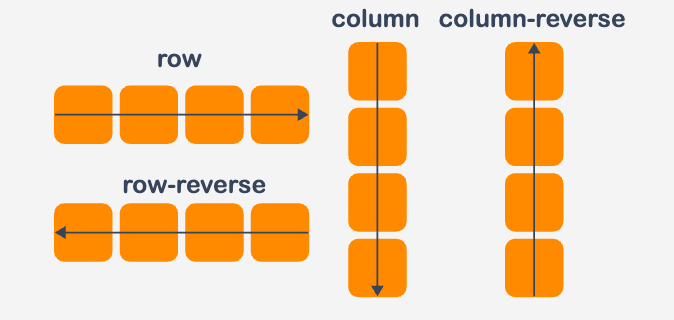
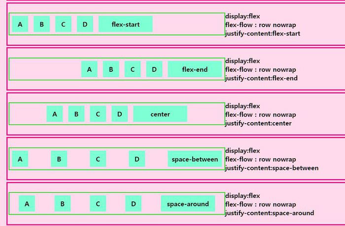
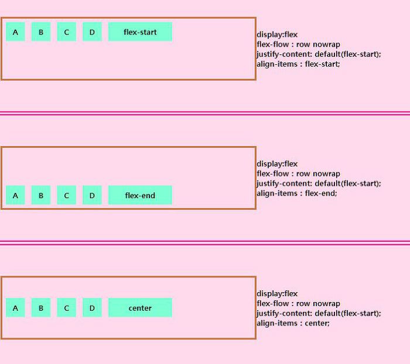

# 스타일링

- expo init react-native-style
- npm install styled-components --force


## 인라인 스타일링
- 컴포넌트에 직접 스타일 입력하는 방식
```js
<View
      style={{
        flex: 1,
        backgroundColor: '#fff',
        alignItems: 'center',
        justifyContent: 'center',
      }}
> 
    <Text>내용</Text> 
</View>
```

## 클래스 스타일링
- 스타일시트에 정의된 스타일을 사용하는 방법
- StyleSheet : React Native의 내장 객체로, 화면에 표시될 요소들의 디자인(예: 배경색, 글꼴 크기, 여백)을 지정하는 역할을 한다.
- import { StyleSheet} from 'react-native';
- const 스타일명 = StyleSheet.create({키1 : { 스타일속성 }, 키2 : { 스타일속성}})
- <컴포넌트명 style={{스타일명.키1}}>
```js
<View style={styles.container}>
      <Text style={styles.text}>
        Inline Styling - Text
      </Text>
      <Text style={styles.error}>Inline Styling - Error</Text>
</View>
...
import {StyleSheet} from 'react-native';

const styles = StyleSheet.create({
  container: {
    flex: 1,
    backgroundColor: '#fff',
    alignItems: 'center',
    justifyContent: 'center',
  },
  text: {
    padding: 10,
    fontSize: 26,
    fontWeight: '600',
    color: 'black',
  },
  error: {
   padding: 10,
    fontSize: 26,
    fontWeight: '400',
    color: 'red',
  },
});

```

## 주요 스타일 속성

### flex 
- 요소가 공간을 차지하는 비율 설정
- width, height 설정

### flexDirection
- 컴포넌트는 위에서 아래로 쌓이는데 그 방향을 설정
- colomn : 세로로 정렬
- colomn-reverse : 세로로 역방향 배치
- row : 가로로 정렬
- row-reverse : 가로로 역방향 배치



### justifyContent 
- 주축(세로 또는 가로)으로 정렬방식을 설정
- flex-start: 자식 요소들을 주축의 시작 부분에 배치한다. (기본값)
- center: 자식 요소들을 주축의 중앙에 배치한다.
- flex-end: 자식 요소들을 주축의 끝 부분에 배치한다.
- space-between: 첫 번째 자식 요소는 주축의 시작 부분에, 마지막 자식 요소는 주축의 끝 부분에 배치하며, 각 자식 요소 간에 동일한 간격을 둔다.
- space-around: 자식 요소들 사이에 동일한 간격을 배치하되, 주축의 양 끝에도 반 간격만큼의 여백을 둔다.
- space-evenly: 모든 자식 요소들 사이에 동일한 간격을 두며, 주축의 양 끝에도 동일한 간격을 둔다.



### alignItems 
- 교차 방향(주축과 수직)으로 정렬방식을 설정
- flex-start : 시작점에서부터 정렬(기본값)
- flex-end : 끝에서부터 정렬
- center : 중앙 정렬
- stretch: alignItems의 방향으로 확대
- baseline : 컴포넌트 내부의 텍스트 베이스라인을 기준으로 정렬


### backgroundColor : 배경색 지정
### fontSize : 글자 크기 지정, 숫자로 입력 
### padding : 테두리 내부 빈공간 지정
### margin : 테두리 외부 빈공간 지정
### fontWeight : 글자 두께 지정 ''사이에 숫자로 표시
### color : 글자 색상 지정
### 그림자
- 그림자는 리액트 네이티브에서 플랫폼마다 다르게 적용되는 스타일 속성
- 리액트 네이티브에서 제공하는 Platform 모듈을 이용해 각 플랫폼마다 다른 코드가 적용되도록 코드를 작성할 수 있다.
- 문서 : https://bit.ly/react-native-platform
### borderBottomWidth : 아래 태두리 두께조절


## 여러개 스타일 적용
- 뒤에 오는 스타일이 앞의 스타일을 덮는다.
```js
<Text style={[styles.text, { color: 'green' }]}> 
// green 이 표현된다
```

## Styled-component
- 스타일이 적용된 컴포넌트
- npm install styled-components@5.3 --legacy-peer-deps
- import styled from "styled-components";
- const 컴포넌트명 = styled.내부컴포넌트`스타일내용`
```js
const StyledText = styled.Text`
    font-size: 20px;
    text-align:center;
    margin-bottom: 10px;
`
<StyledText>Book List</StyledText>
```
### props 사용하기
- const 컴포넌트명 = styled.내부컴포넌트` 속성 : ${props=>prop.OO==='OO'?'OO':''XX'}`
- <컴포넌트명 키=값>
```js
import React from 'react';
import styled from 'styled-components';

const ButtonContainer = styled.Pressable`
 background-color: ${props =>
    props.title === 'Hanbit' ? '#3498db' : '#9b59b6'};
  border-radius: 15px;
  padding: 15px 40px;
  margin: 10px 0px;
  justify-content: center;
`;
...

const Button = props => {
  return (
    <ButtonContainer title={props.title}>
      <Title>{props.title}</Title>
    </ButtonContainer>
  );
};

export default Button;
```
### attrs 사용하기
- - const 컴포넌트명 = styled.내부컴포넌트.attrs(props=>({ 속성 설정 }))`스타일내용`

```js
import React from 'react';
import styled from 'styled-components';

const StyledInput = styled.TextInput.attrs(props => ({
  placeholder: 'Enter a text...',
  placeholderTextColor: props.borderColor,
}))`
  width: 200px;
  height: 60px;
  margin: 5px;
  padding: 10px;
  border-radius: 10px;
  border: 2px;
  border-color: ${props => props.borderColor};
  font-size: 24px;
`;

const Input = props => {
  return <StyledInput borderColor={props.borderColor} />;
};

export default Input;
```
