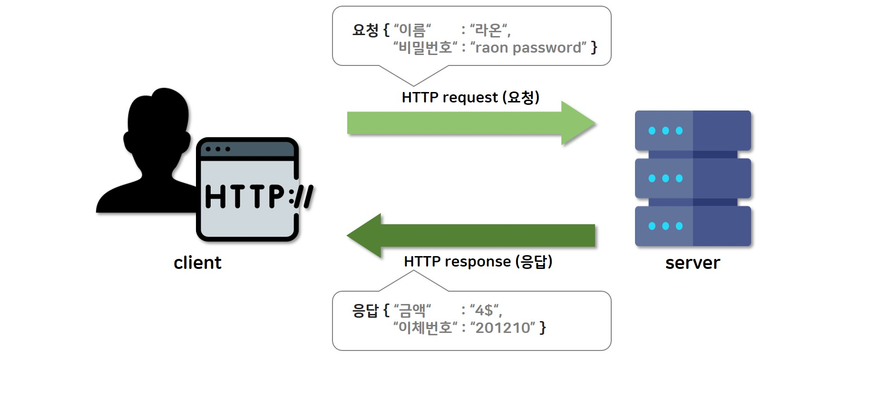

# HTTP 배경지식

- HTTP : 웹에서 클라이언트와 서버간에 테이터를 주고 받기 위한 프로토콜(통신규약)

## 웹에서 HTTP 사용 구조

- 사용자(클라이언트)는 브라우저를 통해 서버에 HTML 요청을 한다.
- 서버는 요청에 대한 결과로 HTTP 응답을 렌더링 한다.

## HTML 요청
- HTML요청에는 송신자의 다양한 정보가 담긴다.
'''
GET /api/users?id=123 HTTP/1.1
Host: www.example.com
User-Agent: Mozilla/5.0 (Windows NT 10.0; Win64; x64) AppleWebKit/537.36 (KHTML, like Gecko) Chrome/85.0.4183.102 Safari/537.36
Accept: text/html,application/xhtml+xml,application/xml;q=0.9,image/avif,image/webp,image/apng,*/*;q=0.8
Connection: keep-alive
'''
- www.example.com으로 GET 요청을 전송
- HTTP 버전은 1.1 , 운영체제는 윈도우10, 요청시 크롬 사용 

### 요청 메서드
- GET : 서버에서 리소스(데이터 정보) 요청할 때 사용
- POST : 서버에 데이터를 전송할때 사용
- PUT : 서버의 기존 데이터 업데이트 할때 사용
- DELETE : 서버의 데이터를 삭제할때 사용

## HTML 응답
- 응답 HTML도 여러가지 정보를 담는다.
```
HTTP/1.1 200 OK
Date: Tue, 24 Sep 2024 11:00:00 GMT
Content-Type: text/html; charset=UTF-8
Content-Length: 4576
Connection: keep-alive

<html lang="en">
</html>
```
- 200 ok : 요청이 성공적으로 처리됨
- Data : 서버가 응답을 보낸 시간
- Content-type : 응답의 미디어 타입(콘텐츠 유형)

### 상태코드
- 요청 처리가 어떻게 되었는지 알려준다.
- 200번대 : 요청이 성공적으로 처리됨
- 300번대 : 리다이렉션 되었음 
- 400번대 : 요청이 잘못되었음
- 500번대 : 서버에 문제가 있음

### Content-Type 콘텐츠 유형
- text/html : HTML 문서
- application/xml : XML 데이터
- application/json : API 응답, JSON 데이터
- application/javascript : 자바스크립트 파일
- image/png , image/jpeg , image/gif , audio/mpeg , video/mp4 , application/pdf , application/zip

### Response Body

- HTTP 응답의 일부로 클라이언트가 요청한 리소스나 데이터를 포함하는 본문
- 포함할 수 있는 데이터 : HTML, JSON(주로사용), XML, Plain Text, 이미지 동영상(바이너리 파일형식)